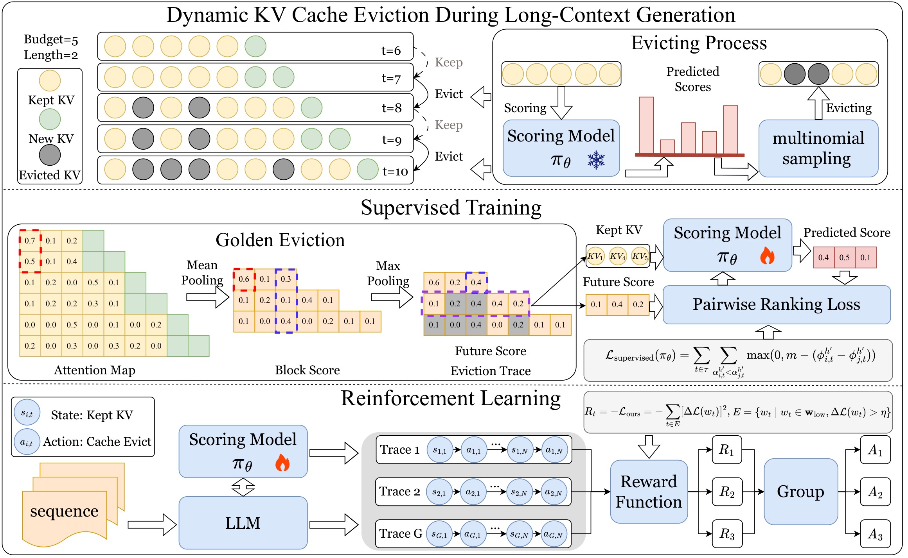

# ForesightKV: Optimizing KV Cache Eviction for Reasoning Models by Learning Long-Term Contribution ([Paper](https://arxiv.org/abs/2602.03203))



This repository contains the training and evaluation code for ForesightKV.

## Installation

Install the Python dependencies first:

```bash
conda create -n foresightkv python=3.10
conda activate foresightkv
pip install -r requirements.txt
```

The training scripts use `flash_attention_2`. Install a compatible `flash-attn`
build separately if you plan to run supervised training or reinforcement
learning on GPU.

## Supervised Training

```bash
cd supervised_training
python train.py \
    --model_name path/to/qwen3-base-model \
    --dataset path/to/supervised-data \
    --checkpoint_path checkpoints/r1kv-sl
```

Qwen2 variant:

```bash
cd supervised_training
python train_qwen2.py \
    --model_name path/to/qwen2-base-model \
    --dataset path/to/supervised-data \
    --checkpoint_path checkpoints/r1kv-qwen2-sl
```

Notes:

- `--dataset` should point to a Hugging Face dataset saved with `load_from_disk`.
- `train.py` and `train_qwen2.py` infer layer count and KV head layout from the
  loaded config, so they are not limited to a single model size.
- the current script expects at least 2 CUDA devices because it places the
  train model on `cuda:0` and the reference model on `cuda:1`

## Reinforcement Learning

```bash
cd reinforcment_learning
torchrun --nproc_per_node=NUM_GPUS train.py \
    --model_name checkpoints/r1kv-sl \
    --data_name path/to/reinforcement-data \
    --checkpoint_path checkpoints/r1kv-rl
```

Qwen2 variant:

```bash
cd reinforcment_learning
torchrun --nproc_per_node=NUM_GPUS train_qwen2.py \
    --model_name checkpoints/r1kv-qwen2-sl \
    --data_name path/to/reinforcement-data \
    --checkpoint_path checkpoints/r1kv-qwen2-rl \
    --judge_init_path checkpoints/r1kv-qwen2-sl
```

Notes:

- the directory name is `reinforcment_learning` in this repository
- `--data_name` should point to a Hugging Face dataset saved with `load_from_disk`
- `train.py` and `train_qwen2.py` both accept `--total_training_steps`,
  `--rollouts_per_step`, `--checkpoint_interval`, and related RL hyperparameters
  as CLI arguments

## Evaluation

Generation:

```bash
cd evaluation
python run_math.py \
    --dataset_path ./data/aime24.jsonl \
    --save_path ./outputs/example.jsonl \
    --model_path path/to/model \
    --method fullkv
```

Scoring:

```bash
cd evaluation
python evaluation/eval_math.py \
    --exp_name example \
    --output_dir ./eval_outputs_example \
    --base_dir ./outputs \
    --dataset aime24
```

GPQA data is available at `evaluation/data/gpqa.jsonl`. The public copy keeps
only the question (`input`) and gold answer (`output`).

GPQA generation:

```bash
cd evaluation
MODEL_PATH=path/to/model bash scripts/run_gpqa.sh
```

GPQA scoring:

```bash
cd evaluation
BASE_DIR=./outputs OUTPUT_DIR=./eval_outputs_gpqa bash scripts/eval_gpqa.sh
```

## Citation

If you use this repository, please cite:

```bibtex
@article{dong2026foresightkv,
  title={ForesightKV: Optimizing KV Cache Eviction for Reasoning Models by Learning Long-Term Contribution},
  author={Dong, Zican and Liu, Peiyu and Li, Junyi and Chen, Zhipeng and Peng, Han and Wang, Shuo and Zhao, Wayne Xin},
  journal={arXiv preprint arXiv:2602.03203},
  year={2026}
}
```
